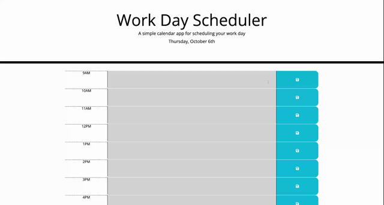

# Work Day Scheduler

## Description

Work Day Scheduler is a simple calendar application that allows a user to save events for each hour of the day. This app will run in the browser and feature dynamically updated HTML and CSS powered by jQuery.

Here is the link to the [deployed application](https://shwethareddy0.github.io/work-day-scheduler/)

### Features

- Fully Responsive
- Easy to modify
- Supports HTML5, CSS3 & JavaScript

## Table of Contents

- [Installation](#installation)
- [Usage](#usage)
- [Technologies Used](#technologiesused)
- [Credits](#credits)
- [License](#license)

## Installation

- Create a new repository on your GitHub account.
- Clone this repository to modify the files and images as required.
- Push your changes to your GitHub repository.
- Deploy to your preferred hosting service.

## Usage

This project can be used in any web browser or on any devices including the mobile devices.

The following image is the demo screenshot of the deployed application.



Following is a code snippet of the application page.

Here it refers to - When the page is refreshed,the saved events should persist, which is one of the selection criterias.

```html5

var workDayScheduleFromLocalStorage = JSON.parse(
  localStorage.getItem("work-day-schedule")
);
if (workDayScheduleFromLocalStorage !== null) {
  for (i = 9; i <= 17; i++) {
    $("#" + i + " textarea").val(workDayScheduleFromLocalStorage[i]);
  }
}


```

## Technologies Used

- HTML5
- CSS3
- JavaScript
- jQuery
- Moment.js
- Bootstrap
- Git
- GitHub
- GitHub Pages

## Credits

- MDN / W3Schools
- Stack Overflow

## License

This project is licensed under the [MIT](./LICENSE) license.
